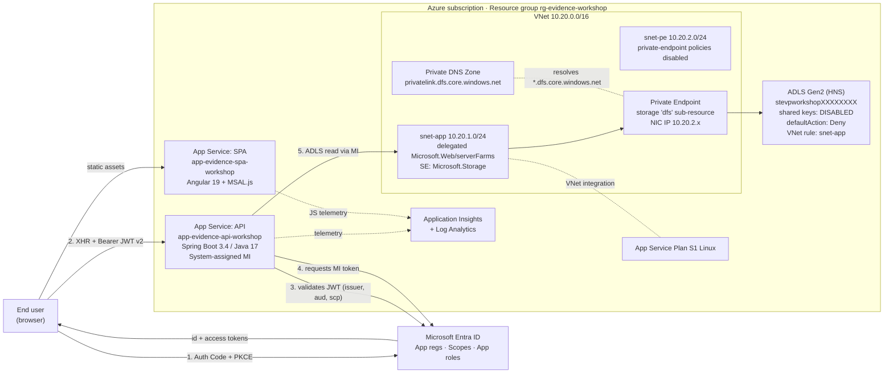
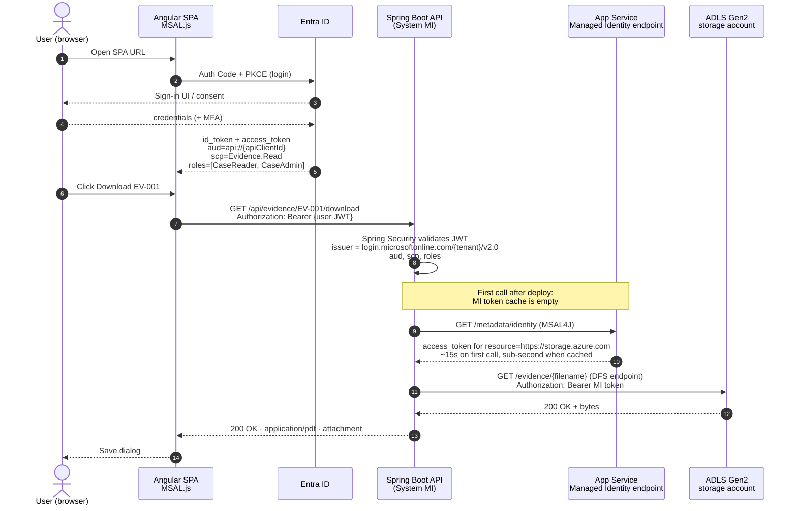
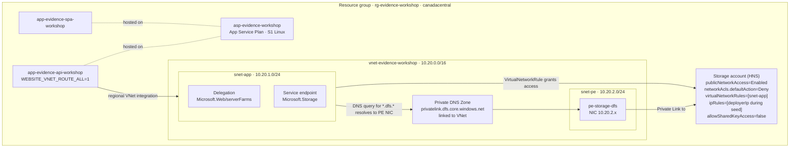
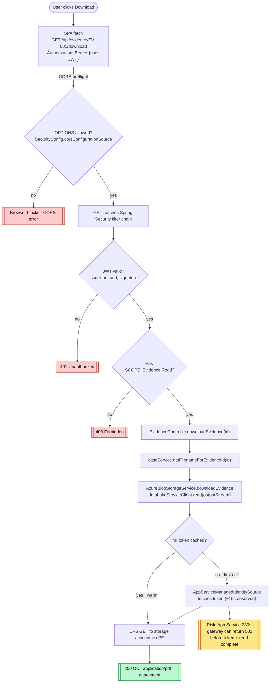
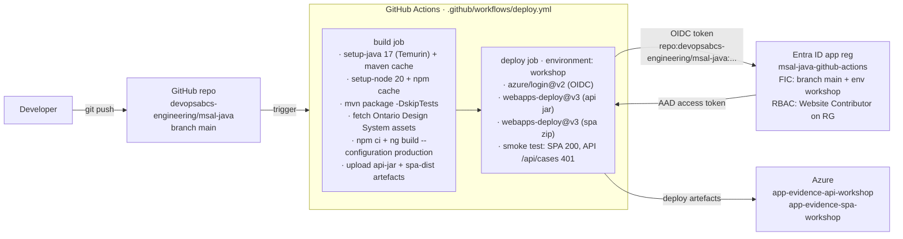

## Architecture

The Justice Evidence Portal is a three-tier application that uses Microsoft Entra ID across every layer: the SPA authenticates users with Auth Code + PKCE, the API enforces JWT v2 + scope and role authorisation, and the API talks to Azure Data Lake Storage Gen2 with its system-assigned Managed Identity over a Private Endpoint. There are no storage account keys, no SAS tokens, and no anonymous endpoints anywhere in the data path.

The next four diagrams break the system down by concern: the high-level topology, the identity and token flow, the network and DNS plane, and the anatomy of a single download request. A fifth diagram further down covers the GitHub Actions deployment pipeline.

### High-Level Topology



### Identity and Token Flow

Two distinct OAuth 2.0 flows are happening at the same time, and they share the same identity provider but never share tokens. The user-facing Auth Code + PKCE flow gets the SPA a delegated access token that the API can validate. Independently, the API's Managed Identity flow gets a separate token that lets it call ADLS Gen2 as itself.



### Network and Private DNS

This is the topology the Bicep modules in [infra/modules/](infra/modules/) provision. Two subtleties are worth calling out. First, ADLS Gen2 uses the **dfs** sub-resource on the Private Endpoint, not the **blob** one, and the SDK call must therefore go through the DataLake client (see [AzureBlobStorageService.java](sample-app/api/src/main/java/com/example/evidence/service/AzureBlobStorageService.java) and [AzureStorageConfig.java](sample-app/api/src/main/java/com/example/evidence/config/AzureStorageConfig.java)). Second, the storage account keeps `publicNetworkAccess=Enabled` *on purpose* — that is the only mode in which `virtualNetworkRules` are honoured. The default action is still `Deny`, so the only public callers that can reach the account are those that match the temporary deployer-IP allow-list during sample-evidence seeding (see the comment block at the top of [storage-account.bicep](infra/modules/storage-account.bicep)).



### Anatomy of a Download Request

This is the sequence to keep in mind when something goes wrong: a `502 Bad Gateway` on the very first download after deploy, mysterious CORS errors in the browser, or a 401 instead of a 403. Each decision diamond is enforced by a different component and produces a different failure mode.



## Scenario

The workshop centers on a Justice Evidence Portal: a secure application for managing case evidence files. Users authenticate through Entra ID, and the API enforces role-based access (CaseReader, CaseAdmin) before serving evidence documents from Azure Storage. External partners access the system as B2B guest users within the organization's tenant.

## Getting Started

### Prerequisites

| Tool | Version | Purpose |
| --- | --- | --- |
| Node.js | 20 LTS or later | Angular SPA build and development |
| Java JDK | 17 or later | Spring Boot API compilation and runtime |
| Maven | 3.9 or later (auto-installed by start script) | Java dependency management and build |
| Azure CLI | 2.60 or later | Azure resource provisioning and deployment |
| VS Code | Latest | Recommended editor with extensions |

### Quick Start (Run Locally in 2 Minutes)

The sample apps work immediately without any Azure or Entra ID configuration. The `dev` profile serves 5 mock cases and permits all API requests so you can explore the code before setting up authentication.

1. **Clone the repository** (or click "Use this template" on GitHub):

   ```bash
   git clone https://github.com/devopsabcs-engineering/msal-java.git
   cd msal-java
   ```

2. **Start both apps** with a single command:

   **PowerShell (Windows):**

   ```powershell
   .\scripts\start.ps1
   ```

   **Bash (macOS/Linux):**

   ```bash
   ./scripts/start.sh
   ```

   The start script automatically:
   - Downloads and installs Maven if it is not found on your PATH
   - Installs SPA npm dependencies if `node_modules` is missing
   - Kills any previous instances on ports 4200 and 8080
   - Starts the Spring Boot API (`http://localhost:8080`)
   - Starts the Angular SPA (`http://localhost:4200`)

3. **Verify the API** returns mock data:

   ```bash
   curl http://localhost:8080/api/cases
   ```

   You should see 5 JSON case objects.

4. **Open the SPA** at [http://localhost:4200](http://localhost:4200) to see the Justice Evidence Portal landing page.

> **Note:** The "Sign In" button will fail until you complete Exercise 1 (Entra ID app registration). The API endpoints are fully functional without authentication in dev mode.

### Bootstrap Entra ID App Registrations (PowerShell)

[scripts/setup-entra-apps.ps1](scripts/setup-entra-apps.ps1) is an idempotent PowerShell helper that creates and fully configures the SPA and API app registrations against the tenant you are currently logged in to with the Azure CLI. It is the fastest path through Exercise 1 if you prefer scripting over the Azure Portal.

What it does (every call is a no-op if the resource is already configured the right way):

- Verifies `az` is installed and you are signed in (`az login`).
- Acquires a Microsoft Graph access token and calls Graph directly via `Invoke-RestMethod` (no `az rest` quoting issues on Windows).
- Creates the **API app**, sets its Application ID URI to `api://<appId>`, exposes the `Evidence.Read` OAuth2 scope, and defines the `CaseReader` and `CaseAdmin` app roles.
- Creates the **SPA app**, configures its SPA platform redirect URI(s), grants the delegated `Evidence.Read` permission, and pre-authorizes the SPA on the API.
- Creates service principals for both apps if they don't exist yet.
- (Optional, default on) Grants tenant admin consent for the SPA's delegated permission and self-assigns the signed-in user to both `CaseReader` and `CaseAdmin` so you can sign in immediately.
- (Optional, default on) Patches the local `environment.ts`, `environment.prod.ts`, and `application.properties` files with the resulting client/tenant IDs and scope URI.

Usage:

```powershell
# Sign in to the tenant where the apps should live
az login --tenant <tenantId>

# Bootstrap both app registrations and patch local config
.\scripts\setup-entra-apps.ps1 `
    -SpaName "Evidence Portal SPA" `
    -ApiName "Evidence Portal API"

# Re-run later with a production redirect URI (idempotent)
.\scripts\setup-entra-apps.ps1 `
    -SpaName "Evidence Portal SPA" `
    -ApiName "Evidence Portal API" `
    -ProductionRedirectUri "https://my-spa.azurewebsites.net" `
    -OutputFile ".\.entra-apps.json"
```

The script returns and prints `tenantId`, `apiAppId`, `apiObjectId`, `apiServicePrincipalId`, `apiScopeId`, `apiScopeUri`, `roleReaderId`, `roleAdminId`, `spaAppId`, `spaObjectId`, `spaServicePrincipalId`, plus the redirect URIs and consent/role-assignment status. With `-OutputFile` it also writes a JSON state file that [scripts/deploy.ps1](scripts/deploy.ps1) consumes on its next run, so you don't need to re-run setup before every deployment.

> Skip the patching or admin consent with `-UpdateLocalConfig:$false`, `-GrantAdminConsent:$false`, or `-AssignCurrentUserToRoles:$false` if you would rather wire those up by hand.

### Fast-Track to Azure (One Command)

If you want to see the deployed end-state in Azure as quickly as possible — without going through the four guided exercises — run the one-stop deployment script. It chains every step of Exercises 1 and 4 into a single idempotent run.

```powershell
# Sign in once to the tenant where the apps and Azure resources should live
az login --tenant <tenantId>
az account set --subscription <subscriptionIdOrName>

# Deploy everything (Entra ID + Bicep + SPA + API + evidence files)
.\scripts\deploy.ps1
```

What `deploy.ps1` does end-to-end:

1. Verifies `az`, `node`, `mvn` (auto-installs Maven into `%LOCALAPPDATA%\Maven` if missing).
2. Calls `setup-entra-apps.ps1` to create/reuse both app registrations, expose the scope and roles, force the API token version to v2, grant admin consent, and assign your user to `CaseReader` + `CaseAdmin`.
3. Creates the resource group `rg-evidence-workshop` in `canadacentral` and a deterministic globally-unique storage account name.
4. Detects your public IP and Entra principal objectId so the seed step can run over OAuth without ever using a shared key.
5. Deploys the Bicep stack: VNet (`snet-app` delegated to `Microsoft.Web/serverFarms` with the `Microsoft.Storage` service endpoint, `snet-pe` for endpoints), App Service Plan (S1 Linux — minimum SKU for VNet integration), two App Services with system-assigned Managed Identity and Regional VNet integration, hardened ADLS Gen2 storage (`isHnsEnabled=true`, `allowSharedKeyAccess=false`, `publicNetworkAccess=Enabled` with `networkAcls.defaultAction=Deny` and a `VirtualNetworkRule` for `snet-app` — see [Findings](#findings-and-lessons-learned) for why `Disabled` is wrong here), Private Endpoint on the storage `dfs` sub-resource, Private DNS Zone `privatelink.dfs.<storage suffix>`, Application Insights, and `Storage Blob Data Contributor` role assignment for the API Managed Identity.
6. Patches `environment.prod.ts` with the deployed SPA/API URLs and App Insights connection string.
7. Re-runs `setup-entra-apps.ps1` to add the production SPA URL as a SPA-platform redirect URI on the SPA app registration.
8. Builds the Angular SPA in production mode (with the Ontario Design System assets fetched into `public/vendor/`) and the Spring Boot API as an executable JAR.
9. Deploys the SPA zip and the API JAR with `az webapp deploy`.
10. Uploads the five sample PDFs over OAuth (`--auth-mode login`, no shared keys) using the temporary deployer-IP allow-list and `Storage Blob Data Contributor` RBAC.
11. Re-deploys storage with `deployerIp=''` so `publicNetworkAccess` flips back to `Disabled`. App Services keep working via the Private Endpoint.
12. Smoke-tests the result: SPA URL must return `200`, API `/api/cases` must return `401` (proving JWT validation is enforced).

When it finishes you'll see something like:

```text
Deployment complete

 Resource Group : rg-evidence-workshop
 Region         : canadacentral
 SPA URL        : https://app-evidence-spa-workshop.azurewebsites.net
 API URL        : https://app-evidence-api-workshop.azurewebsites.net
 Storage        : stevpworkshopXXXXXXXX (container: evidence)
```

Open the SPA URL, sign in with the same account you ran the script as, and you should land on the case list with all five sample cases — files served from Blob Storage through the API's Managed Identity.

Common flags:

| Flag | Default | Purpose |
| --- | --- | --- |
| `-ResourceGroup` | `rg-evidence-workshop` | Target resource group (created if missing). |
| `-Location` | `canadacentral` | Azure region. |
| `-Environment` | `workshop` | Suffix used for App Service names (`app-evidence-spa-<env>`, `app-evidence-api-<env>`). |
| `-SkipEntraSetup` | off | Reuse a previous `.entra-apps.json` and skip the Graph calls. |
| `-SkipBuild` | off | Reuse the existing `dist/` and `target/` artifacts. |
| `-SkipUpload` | off | Skip the sample-evidence blob upload. |

When you're done with the workshop, remove everything with:

```powershell
az group delete --name rg-evidence-workshop --yes --no-wait
```

### Continuous Deployment with GitHub Actions

After the first manual deploy with `deploy.ps1`, every push to `main` that touches `sample-app/**` is built and deployed automatically by [.github/workflows/deploy.yml](.github/workflows/deploy.yml). The workflow uses **OIDC federated credentials**, so there is no client secret stored anywhere — GitHub mints a short-lived OIDC token and Azure exchanges it for an access token scoped to the workshop service principal. The workflow is intentionally narrow: it builds the SPA and API, deploys both artefacts, and runs a smoke test. It never touches infrastructure, app registrations, or the storage seed (those remain operator responsibilities driven from `deploy.ps1` / `setup-entra-apps.ps1`).



Bootstrap the OIDC trust once, idempotently:

```powershell
.\scripts\setup-github-oidc.ps1
```

What [scripts/setup-github-oidc.ps1](scripts/setup-github-oidc.ps1) does:

1. Verifies you are signed in to both `az` and `gh` CLIs.
2. Creates (or reuses) the `msal-java-github-actions` Entra ID app registration and its service principal.
3. Adds two Federated Identity Credentials so OIDC tokens issued for the `main` branch and for the `workshop` deployment environment can both exchange for an Azure AD access token. No secret leaves Azure.
4. Grants the SP `Website Contributor` on `rg-evidence-workshop` (and optionally `Storage Blob Data Contributor` on the storage account with `-GrantStorageContributor`).
5. Writes `AZURE_CLIENT_ID`, `AZURE_TENANT_ID`, and `AZURE_SUBSCRIPTION_ID` repository secrets via `gh secret set`.

Re-run it any time — every step is a no-op if the resource is already configured the right way. The workflow's smoke test asserts that `/api/cases` returns `401`, which is the canonical proof that JWT validation is enforced (a `200` would mean the API is wide open; a `5xx` would mean it failed to start or storage is unreachable).

### Workshop Exercises

Follow these exercises in order for the full 3-hour workshop experience. Already saw the Fast-Track land everything in Azure? You can still use these guides as a tear-down of what `deploy.ps1` automated.

| Exercise | Duration | Description |
| --- | --- | --- |
| [Exercise 1: Configure App Registrations](workshop/guides/exercise-1-app-registrations.md) | 30 min | Create Entra ID app registrations for the SPA and API, configure scopes, roles, and update the SPA environment. (Automated end-to-end by `setup-entra-apps.ps1`.) |
| [Exercise 2: Run SPA + API Locally](workshop/guides/exercise-2-run-locally.md) | 30 min | Sign in through the SPA, browse cases, download evidence, and inspect JWT tokens. |
| [Exercise 3: Add Role-Protected Endpoint](workshop/guides/exercise-3-add-endpoint.md) | 20 min | Experience the RBAC cycle: 403 Forbidden, assign CaseAdmin role, re-authenticate, 201 Created. |
| [Exercise 4: Deploy to Azure](workshop/guides/exercise-4-deploy-azure.md) | 20 min | Deploy both apps and infrastructure to Azure using Bicep, verify Managed Identity storage access. (Automated end-to-end by `deploy.ps1`.) |

For the full instructor delivery guide with 9-module schedule and presentation notes, see [workshop/README.md](workshop/README.md).

## Repository Structure

```text
msal-java/
├── .github/
│   └── workflows/
│       └── deploy.yml      # CI/CD: OIDC -> Azure App Service deployment
├── sample-app/
│   ├── api/                # Spring Boot 3.4 REST API (Java 17)
│   │   ├── src/main/java/  # Controllers, services, security config
│   │   ├── src/main/resources/  # Properties, sample data, evidence PDFs
│   │   ├── Dockerfile
│   │   └── pom.xml
│   └── spa/                # Angular 19 Single Page Application
│       ├── src/app/        # Components, services, MSAL config
│       ├── src/environments/  # Dev and prod environment configs
│       └── package.json
├── workshop/
│   ├── guides/             # 4 hands-on exercise guides
│   ├── solutions/          # Exercise 3 solution files
│   └── README.md           # Instructor delivery guide
├── infra/                  # Bicep IaC (App Service, Storage, monitoring, VNet, PE)
│   ├── main.bicep
│   ├── main.bicepparam
│   └── modules/            # 8 Bicep modules incl. vnet + private-endpoint-storage
├── scripts/
│   ├── start.ps1                      # Start both apps locally (Windows)
│   ├── start.sh                       # Start both apps locally (macOS/Linux)
│   ├── deploy.ps1                     # Full Azure deployment (PowerShell)
│   ├── deploy.sh                      # Full Azure deployment (Bash)
│   ├── setup-entra-apps.ps1           # Idempotent app registration bootstrap (PowerShell, Graph API)
│   ├── setup-entra-apps.sh            # Automate app registrations (Bash, az CLI)
│   ├── setup-github-oidc.ps1          # Idempotent OIDC trust + repo secrets for CI/CD
│   ├── configure-app-settings.sh      # Post-deploy configuration
│   ├── fetch-ontario-design-system.ps1  # Pulls Ontario DS assets into the SPA build
│   └── generate-sample-evidence.ps1   # Regenerates the sample PDFs
├── docs/
│   └── production-hardening.md  # Front Door, WAF, CMK, multi-region next-steps
└── README.md
```

## Technology Stack

| Layer | Technology | Version | Purpose |
| --- | --- | --- | --- |
| Frontend | Angular | 19.2 | Single Page Application framework |
| Frontend Auth | MSAL Angular | 5.2 | Entra ID authentication (Auth Code + PKCE) |
| Backend | Spring Boot | 3.4.4 | REST API framework |
| Backend Auth | Spring Security OAuth2 Resource Server | 6.2 | JWT validation with scope and role enforcement |
| Storage | Azure Data Lake Storage Gen2 | `azure-storage-file-datalake` 12.23.0 | Evidence file storage via Managed Identity over Private Endpoint |
| Identity | Azure Identity | 1.18.2 SDK | `ManagedIdentityCredential` in App Service, `DefaultAzureCredential` locally |
| Monitoring | Application Insights | 3.7.8 Agent | Telemetry for SPA (JS SDK) and API (runtime-attach) |
| Infrastructure | Bicep | Latest | Azure resource provisioning (App Service, Storage, monitoring, VNet, PE) |
| CI/CD | GitHub Actions + OIDC | `azure/login@v2` + `azure/webapps-deploy@v3` | Secret-less deploy to App Service on push to `main` |

## Key Design Decisions

- **Dev profile is open**: No authentication required to explore the API locally. JWT validation and `@PreAuthorize` enforcement activate in non-dev profiles. The `LocalStorageService` bean (active under `@Profile("dev")`) serves embedded PDFs from the classpath; `AzureBlobStorageService` (`@Profile("!dev")`) is the production bean.
- **Pinned `ManagedIdentityCredential` in App Service**: [AzureStorageConfig.java](sample-app/api/src/main/java/com/example/evidence/config/AzureStorageConfig.java) detects the `IDENTITY_ENDPOINT` env var and uses `ManagedIdentityCredentialBuilder` directly instead of the `DefaultAzureCredential` chain, which has been observed to fall over silently when one of its earlier providers (e.g. `EnvironmentCredential`) returns an "unavailable" without throwing.
- **No storage keys, no SAS tokens, no anonymous access**: Shared keys are disabled at the storage account; all data-plane access is Entra ID OAuth + RBAC (`Storage Blob Data Contributor` on the API Managed Identity). The seed step uploads sample PDFs the same way (`az storage blob upload-batch --auth-mode login`) under a temporary deployer-IP allow-list that is removed at the end of the deployment.
- **`publicNetworkAccess=Enabled`, but with `defaultAction=Deny`**: Counter-intuitively, the storage account must keep its public-access flag set to **Enabled** so that `virtualNetworkRules` are honoured by the Storage RP. Setting it to `Disabled` causes the account to refuse every request that does not arrive over a Private Endpoint, which silently breaks the regional-VNet-integration path. The default ACL action is still `Deny`, so only the App Service subnet (`snet-app`, granted via a `VirtualNetworkRule`) and any temporary deployer IP can reach the data plane.
- **`Microsoft.Storage` service endpoint on `snet-app` is required**: Empirically, traffic from the regional VNet integration is not trusted by storage networkAcls via the Private Endpoint alone. The subnet must explicitly enable the `Microsoft.Storage` service endpoint, and the account must list that subnet in its `virtualNetworkRules`. Without both halves, the API gets `403 AuthorizationFailure` from storage even though the Private Endpoint resolves correctly.
- **Hardened-by-default network**: App Services run with `WEBSITE_VNET_ROUTE_ALL=1` and `WEBSITE_DNS_SERVER=168.63.129.16` so all storage traffic resolves through the `privatelink.dfs.<storage-suffix>` Private DNS zone to the Private Endpoint NIC IP.
- **Secret-less CI/CD**: GitHub Actions authenticates to Azure via OIDC federated credentials. The repo secrets (`AZURE_CLIENT_ID`, `AZURE_TENANT_ID`, `AZURE_SUBSCRIPTION_ID`) are public IDs only; there is no client secret to rotate.

## Multi-tenant App

The single-tenant `Evidence Portal SPA` registration is the one the workshop deploys by default. Alongside it, a multi-tenant counterpart — `Evidence Portal Multi-Tenant SPA` (client id `0713f130-110b-4982-9ce3-8c9227935ca0`) — has been registered in the home tenant so external Entra ID tenants can be onboarded incrementally. It may eventually replace the single-tenant app once the API and SPA are wired for multi-tenant token validation.

### Onboard a tenant

Two things must be true before users in tenant **T** can sign in:

1. **T is on the allow-list.** On the registration's *Authentication → Supported accounts* blade, *Allow only certain tenants (Preview)* is selected and T's tenant id is listed under *Allowed tenants*. The home tenant where the app is registered is always allowed implicitly.
2. **A service principal for the app exists in T.** Until a user signs in or an admin consents in T, there is no service principal there, no user/group assignment is possible, and no app role can be granted.

`devopsabcs.com` (`a34c69c7-8959-474a-9690-e98bfb0b55c6`) has already been added to the allow-list. Currently allowed tenants:

| Tenant id | Notes |
| --- | --- |
| `cddc1229-ac2a-4b97-b78a-0e5cacb5865c` | Home tenant (`MngEnvMCAP675646.onmicrosoft.com`) |
| `a34c69c7-8959-474a-9690-e98bfb0b55c6` | `devopsabcs.com` |
| `aa93b9d9-037d-4f08-a26d-783cf0e2369` | Additional partner tenant |

Pick the option below that matches the level of access available in the target tenant.

#### Option A — Admin consent URL (recommended)

A Global Administrator (or Privileged Role / Cloud Application Administrator) of the target tenant opens the link below **while signed into that tenant**. It instantiates the service principal and grants tenant-wide consent for any *Admin consent required* delegated scopes.

```text
https://login.microsoftonline.com/{tenantId}/adminconsent?client_id=0713f130-110b-4982-9ce3-8c9227935ca0&redirect_uri=https://app-evidence-spa-workshop.azurewebsites.net
```

For `devopsabcs.com` specifically:

```text
https://login.microsoftonline.com/a34c69c7-8959-474a-9690-e98bfb0b55c6/adminconsent?client_id=0713f130-110b-4982-9ce3-8c9227935ca0&redirect_uri=https://app-evidence-spa-workshop.azurewebsites.net
```

The `redirect_uri` must match a SPA redirect URI registered on the app. Drop the parameter to land on the generic Entra consent confirmation page instead.

#### Option B — User sign-in

Send a user from the target tenant to the SPA URL. Auth Code + PKCE hits `https://login.microsoftonline.com/common/oauth2/v2.0/authorize` and Entra shows the standard consent screen. If any API permission requires admin consent, the prompt is blocked until an admin completes Option A.

#### Option C — Pre-provision via Microsoft Graph

Run from a session signed in as a Global Administrator of the target tenant:

```powershell
Connect-MgGraph -TenantId <targetTenantId> -Scopes "Application.ReadWrite.All","AppRoleAssignment.ReadWrite.All"
New-MgServicePrincipal -AppId 0713f130-110b-4982-9ce3-8c9227935ca0
```

The service principal then appears under *Enterprise applications* in the target tenant. Tenant-wide consent can be granted from *Permissions → Grant admin consent*.

### After consent

Once the service principal exists in the foreign tenant, an admin in that tenant still needs to:

- Toggle *Assignment required?* under *Properties* if user/group gating is desired.
- Assign users or groups to the `CaseReader` and `CaseAdmin` app roles under *Users and groups*. App roles are defined on the home-tenant registration but assigned in each foreign tenant's enterprise application.

### What still needs to change in code to fully support multi-tenant

The registration is multi-tenant, but the SPA and API are not yet configured for it. The following changes are required before tokens issued by `devopsabcs.com` (or any other allowed tenant) will be accepted end to end:

- **SPA `auth-config.ts`**: change the `authority` from a tenant-specific `https://login.microsoftonline.com/{homeTenantId}` to `https://login.microsoftonline.com/common` (any account) or `https://login.microsoftonline.com/organizations` (work/school accounts only). A tenant-pinned authority will fail with `AADSTS50020` for users from other tenants.
- **API JWT validation** ([SecurityConfig.java](sample-app/api/src/main/java/com/example/evidence/config/SecurityConfig.java)): the issuer is currently a single tenant URL. For multi-tenant, validate against the `https://login.microsoftonline.com/common/v2.0/.well-known/openid-configuration` discovery document (which exposes the multi-tenant signing keys) and **enforce the allow-list yourself** by reading the `tid` claim and comparing it to the same set of tenant ids configured in Entra. Without that check, any tenant on the public internet that has consented could mint valid tokens.
- **API app registration**: the resource server (`Evidence API`) must also be set to *Multiple Entra ID tenants* in *Authentication → Supported accounts*, otherwise tokens with `aud=api://{apiClientId}` will not be issued for users outside the home tenant.

Until those three changes ship, the multi-tenant registration is a placeholder — it can be onboarded into other tenants for a smoke test, but `acquireTokenSilent` and the API JWT validator will reject the resulting tokens.

## Findings and Lessons Learned

These are the rough edges this codebase hit on the way to a working production deploy. Each is worth knowing before they bite you in your own environment.

### Cold-start 502 on the first authenticated download

The first authenticated `GET /api/evidence/{id}/download` after a fresh deploy can return `502 Bad Gateway` with no entry in the application log. Subsequent downloads complete in well under a second.

**Why**: The first call into `dataLakeServiceClient.read(...)` triggers `AppServiceManagedIdentitySource` to fetch a Managed Identity token from the App Service IMDS endpoint. In the trace below, that token acquisition took **~18 seconds** (caching was cold, the token endpoint was warming up, and MSAL4J does its own discovery handshake). App Service's front-end gateway has a hard 230-second request timeout, but the Linux container appears to surface a 502 well before that when the Java thread is blocked on a downstream call during the first request after start-up.

```text
2026-05-01T04:42:38.992Z  INFO ... AppServiceManagedIdentitySource : ... Creating App Service managed identity.
2026-05-01T04:42:56.765Z  INFO ... HttpHelper                       : Sent (null) Correlation Id ...
2026-05-01T04:42:56.794Z  INFO ... AbstractManagedIdentitySource    : Successful response received.
2026-05-01T04:42:56.961Z  INFO ... ManagedIdentityCredential        : Azure Identity => Managed Identity environment: Managed Identity
```

**Workaround today**: ignore the first failed request — every subsequent download works while the JVM is alive, because MSAL4J caches the token. **Permanent fix (not yet applied)**: warm the credential at startup with a `@PostConstruct` or `ApplicationRunner` that calls `dataLakeServiceClient.getProperties()` once, so the token cache is populated before the first user request arrives.

### CORS errors in the browser were lying

When the 502 above hits, the browser DevTools console shows a **CORS error** on the same request. That is misleading. App Service's built-in 502 response page is generated by the front-end gateway *before* it ever reaches the application, and the gateway does not reflect any of the application's CORS headers. The browser then sees a response with no `Access-Control-Allow-Origin` and reports the only thing it knows how to: a CORS violation.

**Diagnostic that confirmed it**: a synthetic OPTIONS preflight from the SPA origin returned `Access-Control-Allow-Origin: https://app-evidence-spa-workshop.azurewebsites.net` with status `200`, while a `GET` with a fake bearer token returned `401` (which is the correct Spring Security response). So the application's CORS filter and JWT filter were both healthy — the real bug was the 502 on the warm path. **Lesson**: when you see a CORS error in the browser, sanity-check the actual HTTP status with `curl -v` from outside the browser before going down the CORS rabbit hole.

### `publicNetworkAccess=Disabled` silently breaks the App Service path

An earlier iteration of the Bicep set `publicNetworkAccess: 'Disabled'` on the storage account — intuitively the most secure setting — and the API immediately started returning `403 AuthorizationFailure` from storage. The Private Endpoint *was* in place and DNS *was* resolving to the PE NIC IP, but the App Service VNet integration path goes through the platform's regional NAT before hitting storage, and that path is governed by `virtualNetworkRules`, not by the Private Endpoint. With the public flag flipped to `Disabled`, the Storage RP rejects every request that does not arrive over a Private Endpoint NIC, including the legitimate VNet-integrated ones. Keeping it `Enabled` while leaving `defaultAction=Deny` is the correct posture: nothing public can reach the account, but the explicit `virtualNetworkRules` for `snet-app` are honoured.

### Linux runners and `$env:TEMP`

`scripts/fetch-ontario-design-system.ps1` is invoked from the GitHub Actions workflow under `pwsh` on `ubuntu-latest`, where `$env:TEMP` is undefined. The original Windows-only `Join-Path $env:TEMP <name>` returned `\<name>` and the script failed with a path error. The cross-platform fix is `Join-Path ([System.IO.Path]::GetTempPath()) <name>`, which returns the right thing on Windows, Linux, and macOS.

### `azure-storage-file-datalake`, not `azure-storage-blob`

ADLS Gen2 (HNS-enabled) accounts expose two endpoints: `*.blob.core.windows.net` and `*.dfs.core.windows.net`. The Private Endpoint in this stack is bound to the `dfs` sub-resource and the Private DNS zone is `privatelink.dfs.core.windows.net`. The API therefore must use the DataLake SDK and target the `.dfs` endpoint — using the older `BlobServiceClient` against the same account would resolve to the public `.blob` endpoint, bypass the Private Endpoint entirely, and either be denied by the network ACL or take the slow public path.

## Production Hardening

The workshop already ships with a hardened-by-default network and identity posture: ADLS Gen2 with shared keys disabled, public network access still `Enabled` but `defaultAction=Deny` with a `VirtualNetworkRule` for the App Service subnet, App Service Regional VNet integration, a Private Endpoint on the storage `dfs` sub-resource, and Managed Identity + RBAC end-to-end. For the optional next-step controls (Front Door + WAF, App Service Private Endpoints, customer-managed keys, multi-region failover), see the [Production Hardening Guide](docs/production-hardening.md).

> [!IMPORTANT]
> This is a secure workshop architecture and a strong production baseline, but it is not the maximum-security production pattern yet. The API App Service is still publicly reachable and relies on Entra ID JWT validation, scopes, roles, and CORS for request-level protection. A higher-security production design should also restrict API ingress with App Service access restrictions, an API private endpoint, Azure Front Door Premium or Application Gateway with WAF, or API Management depending on the deployment model. Keep the storage deployer-IP allow-list temporary and narrow; the steady-state storage path should be Managed Identity over the App Service subnet rule and the ADLS Gen2 `dfs` Private Endpoint.

## License

This project is licensed under the MIT License. See [LICENSE](LICENSE) for details.
